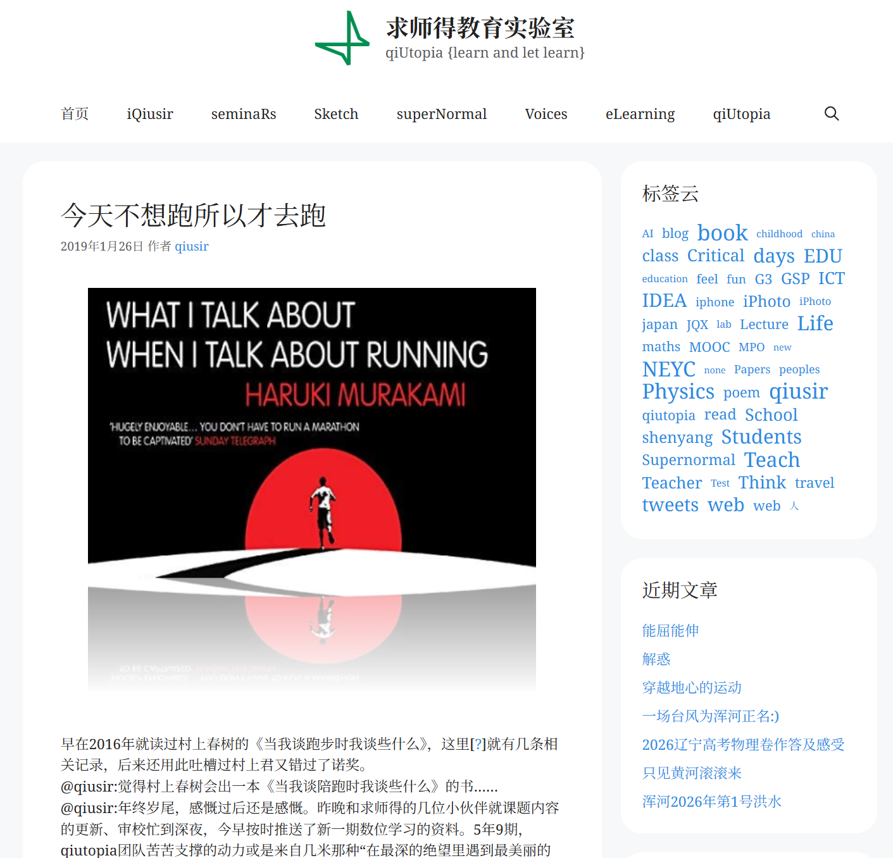

<!-- 
  封面图：将图片放在与 index.md 同目录，命名为 cover.jpg 或 cover.png
  然后在 cover 字段填写文件名。

  分类可选：日常随想 | 读书笔记 | 摄影记录 | 资源分享
-->

最近沈阳的高温天气没有向好的趋势...这几天一直在家里吹着空调，也是感到些许无聊。昨天晚上家父带回两条金枪鱼，收拾完满手鱼腥味，今天也是，哈哈哈。不过炎日和腥味不耽误运动健身，索性从今天开展一个运动计划...

在地图上找了个健身房起一个共享单车就过去了。健身房一楼有更衣室/洗手间/浴室，二楼是器械。前几天向序哥请教了训练计划，建议我爬坡（坡度15/速度3-4）。
![拍这张照片的时候太累了，所以图片很虚...]（1.jpg）
爬坡的时候才突然想起来，虽然之前在很多酒店的健身房里使用过跑步机，但这是我第一次使用跑步机爬坡的功能。爬坡到中途的时候确实很累的，流了很多汗，看来以后还得都带几件衣服...

洗完澡，吹干头发，打车回家。车上想起来之前qiusir推荐的村上春树的那本《当我谈跑步时我谈些什么》

@村上春树《当我谈跑步时我谈些什么》：“希望一人独处的念头，始终不变地存于心中。所以一天跑一小时，来确保只属于自己的沉默的时间，对我的精神健康来说，成了具有重要意义的功课。”

我突然意识到今天的锻炼其实就是“只属于自己的沉默的时间”，这种“创造性独处”令我感觉到平静与充实。当然，也有自由...

@村上春树《当我谈跑步时我谈些什么》：“不管全世界所有人怎么说，我都认为自己的感受才是正确的。无论别人怎么看，我绝不打乱自己的节奏。”

自律不是苦行僧式的自我折磨，而是一种自我关爱和自我实现的方式。正如村上春树所说："喜欢的事自然可以坚持，不喜欢怎么也长久不了。"

@qiusir：喜欢的事情自然可以坚持下去，不喜欢的事情怎么也坚持不了。意志之类恐怕也与“坚持”有一丁点瓜葛，然而无论何等意志坚强的人、何等争强好胜的人，不喜欢的事情终究做不到持之以恒；就算做到了，也对身体不利。（生活中多少坚持是用身心为代价换来的呢？）
觉得今天不想跑步的时候…是啊，连这么一丁点的事情也不肯做，可要遭天谴呀。
@huaoyan：qiusir好幽默啊...:)
  
晚上吃的是金枪鱼馅儿的饺子，没错就是昨天晚上那一条，配上辣椒酱很好吃...

:)