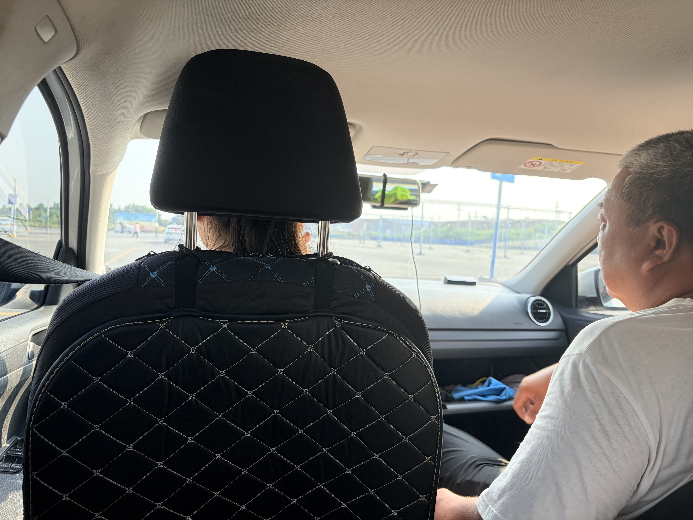
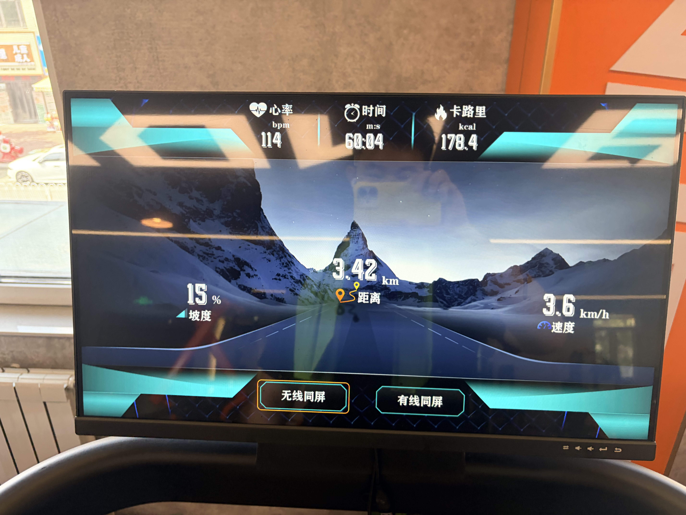

<!-- 
  封面图：将图片放在与 index.md 同目录，命名为 cover.jpg 或 cover.png
  然后在 cover.image 字段填写文件名。例如：
    cover:
      image: cover.jpg

  分类可选：日常随想 | 读书笔记 | 摄影记录 | 资源分享
-->

昨天晚上睡得很早，今天早上5点就起床被教练接去练车了，在去的路上得知可以在8月10号考科目二了，算是意外之喜了......同行的还有两位大哥大姐，整体氛围算不上无聊。

锻炼计划按部就班进行，今天的爬坡训练时间延长到了1个小时，相当累了。
至今也不知道坡度15速度3.6是一个什么水平......

爬完坡后，稍微练练腿，也没拉伸，就去球馆和小鉴打篮球去了，路上才想起来没带篮球鞋......
打完球带小鉴回家吃饭，打了一会游戏。

在车上和小鉴聊了聊高三时期的美好，一些行为现在想想都有一些过分，但是在当时的氛围里大概也没什么大不了的。想来当时那些痛并快乐的日子再也不会有了，无论是痛还是快乐......

最近好像没怎么读书呢，明天重新开始吧

胳膊好疼啊，哈哈哈。
