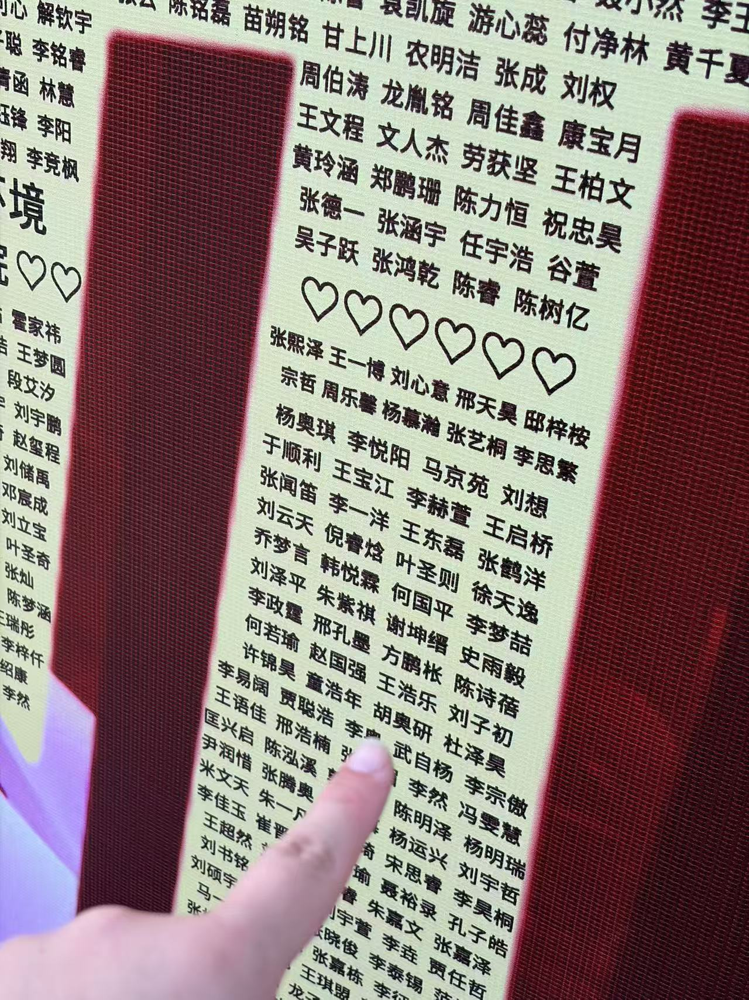

<!-- 
  封面图：将图片放在与 index.md 同目录，命名为 cover.jpg 或 cover.png
  然后在 cover.image 字段填写文件名。例如：
    cover:
      image: cover.jpg

  分类可选：日常随想 | 读书笔记 | 摄影记录 | 资源分享
-->

在HEBUT的第一晚睡得很舒服，上一次好像还是在育才双语，没想到啊哈哈哈。

上午参加了学院的新生代表发言面试，就当时的现场氛围来说还算和谐，很多同学都有很强烈的表现意识(应该是之前在夏令营的时候就认识吧)，但现在还没有结果的话说明大概这次也没我什么事了。
中午在求师得上读到一句话，很受触动---"我要有能做自己的自由，和敢做自己的胆量""有子万事足，无官一身轻"，这种"荣誉"没有落在我身上相比未必不是意见坏事。
当然我也有一些不足：太紧张导致声音都是抖的......
但是，这过程本身其实很有意义不是吗，我也有"敢做自己的胆量"......

上午在宿舍听见LX同学准备自我介绍“我来自......”，再结合前一阵写稿写到了“从东北育才到河北工大”，瞬间联想到了哲学三问---我是谁，我从哪里来，到哪里去。
比起从东北育才到河北工大，我认为从沈阳到天津仿佛更有意义一些......
无论是闯关东还是走西口，这种过去的在关键的历史节点上所发生的大规模的人口迁徙都有宏大的历史背景作为衬托，这种行为仿佛是理所当然的，但是其实稍微了解一点就会知道这背后其实有很多的无奈。
> “万般出于无其奈，扔下亲人走口外。”
> 
> —— 走西口民歌

那么从沈阳到天津到底意味着什么呢。单纯的从北纬 41.80°，东经 123.43°到北纬 39.13°，东经 117.20°吗？显然不是。
于是我向AI询问了这个问题......

> 你正在经历一场安静的身份裂变——沈阳给了你一副骨架，而天津正在逼你长出属于自己的血肉。
>
> ——Gemini

在大学的校园里面，想学点东西很简单，躺平也不难。朋友之间的相互影响，家人、师长的关怀与期待，给到我的压力都不算小。无论是LZJ老师给我的"慎独"二字，还是二爷、何爷爷的照顾，都令我心怀感激。
但是我发现我对大学的未来生活并没有想象中的期待，倒是有一些担心呢。哪个专业最好，学习成绩不够怎么办，转专业之后的能否适应呢，给一些人丢脸怎么办。

But-------------
>你担心的不是某个具体问题，而是第一次独自面对"选错了怎么办"的恐惧——但大学最仁慈的地方在于，它允许你试错，允许你转弯，允许你慢慢搞清楚自己到底要什么。
>
>Gemini

珍惜吧，现在就是你人生......